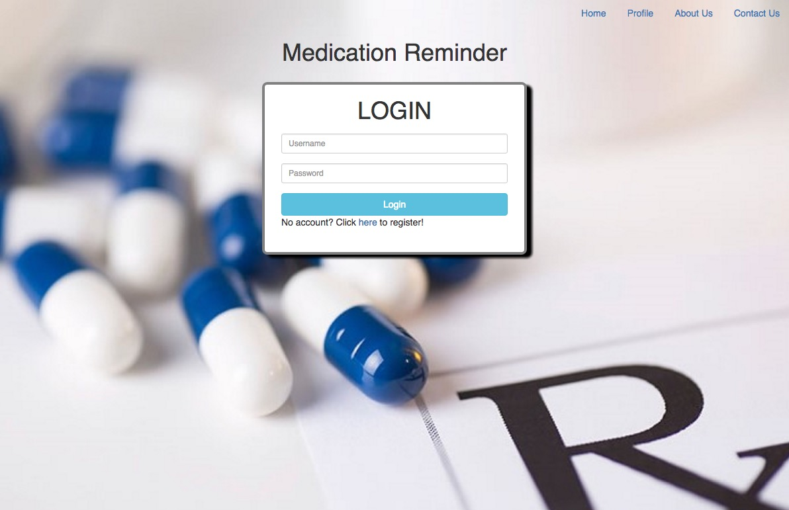

# Medication Reminder App

Generate an email reminder to take a medication at specific times every week. Demo it [here](https://jpke.github.io/medicationReminder_Portfolio/#/).

## Motivation
This was an early fullstack project built with react and express in the fulltime [Thinkful Web Development Bootcamp](https://www.thinkful.com/bootcamp/web-development/full-time/).

The objective was to create a simple scheduler, which generates an email at set intervals. This was achieved using [node-schedule](https://github.com/node-schedule/node-schedule) in Express to call [mailjet](https://www.mailjet.com/).

##Technologies

| **Tech** | **Description** |
|----------|-------|
|  [React](https://facebook.github.io/react/)  |   Javascript framework for single page apps   |
|  [Redux](http://redux.js.org/)  |   Application state management for react    |
|  [Express](http://expressjs.com/)  |   Server framework for Node   |
|  [MongoDB](https://www.mongodb.com/)  |   No-SQL database    |
|  [Mailjet](https://dev.mailjet.com/)  |   Automated email generator   |

## API
#### The server code can be found [here](https://github.com/jpke/PortfolioExpress/blob/master/medReminder.js)

* POST /user :: creates new user
* PUT /user :: updates username or password
* DELETE /user :: deletes user
* GET /medication :: returns array of medication reminders associated with user
* POST /medication :: creates medication reminder
* PUT /medication :: updates medication reminder
* DELETE /medication :: deletes medication reminder

## Develop

To develop this app's front end, make sure you have node and npm [installed](https://docs.npmjs.com/getting-started/installing-node), then:

- clone the repo
- cd into repo, then run `npm install`
- start development server with `npm start`
- navigate to `http://localhost:3000` in your browser to access app

To develop this app's server side:
- change `rootUrl` in `src/actions.js` to `http://localhost:8080` (or other port if specified) in order to develop locally.
- the server side is currently a submodule of a larger portfolio server
- develop run the medication reminder express server locally:
  - clone, configure and start the [app's express server](https://github.com/jpke/PortfolioExpress/blob/master/medReminder.js)
  - comment or delete `app.use('/blog', blog)` and `app.use('/elearn', eLearn)`
  - comment or delete files:
    - `blog.js`
    - `box.js`
    - `eLearn.js`
  - obtain [Mailjet API](https://dev.mailjet.com/) credentials by [signing up](https://app.mailjet.com/signup) (for free)
  - add `.env` file, containing:
    - `MAILJET_KEY` :: your Mailjet application public key
    - `MAILJET_SECRET` :: your Mailjet application private key
    - `ALERT_FROM_EMAIL` :: email address you want to alert to be sent from
    - `ALERT_FROM_NAME` :: name you want email to appear sent from
    - `DATABASE_URI` :: connection to your mongo database `'mongodb://<database name>'`
  - start server with `node server.js`
  - server will now run at `http://localhost:8080` by default

  ##
##### Contributers
* oshirodk
* phc5
* jpke

This app is built in create-react-app. It was derived from [another build](https://github.com/oshirodk/medicationReminder).
